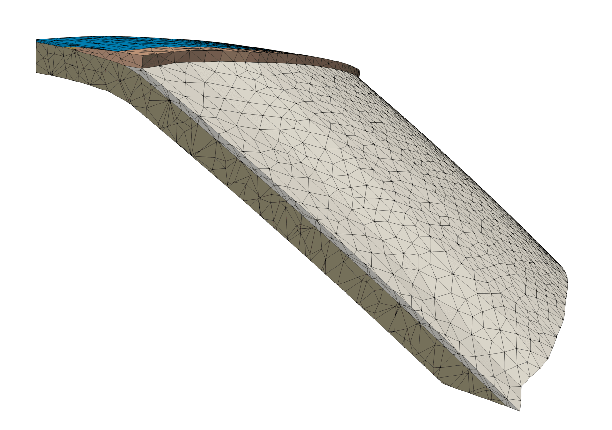

# Module 3: Deform Slab

Projection of the slab on the topography described by Slab2.0 ([Hayes et al. 2018](https://www.science.org/doi/10.1126/science.aat4723)).

<p align="center">
 
</p>

Run the following script in the current directory:


```
./03_deform_slab.sh
```

---

## File details
---

- [`round_subduction.inp`](round_subduction.inp): Round the nodes of the subduction at different depths.
- [`refine_iterative.inp`](refine_iterative.inp): Refine the slab at each step of the deformation process.
- [`slab_todeform.inp`](slab_todeform.inp): Deform the slab.
- [`projection.py`](projection.py): Project a point on the surface of a triangle.
- [`deform_slab_iterative.py`](deform_slab_iterative.py): Main file that manages the iterative deformation of the slab.
- [`check_thickness.py`](check_thickness.py): Compute the thickness of the slab (SLAB) and of the subduction channel (CH) at the end of the deformation process.
