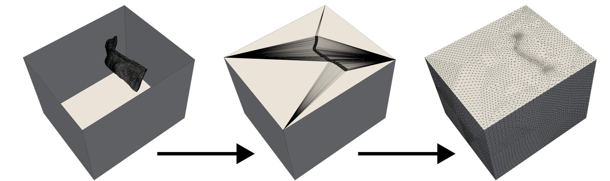

# Module 4: Insertion Box


Run the following script in the current directory:

```
./04_insertion_box.sh
```





---

## File details
---

- `insert_slab.py` manual construction of the surface's triangulation
- `fill_volume.inp` fill and remesh the box

## Notes

The manual triangulation of the surface is straightforward in this case.
If needed an automatic triangulation tool could be used, e.g. [CDT](https://github.com/artem-ogre/CDT).
