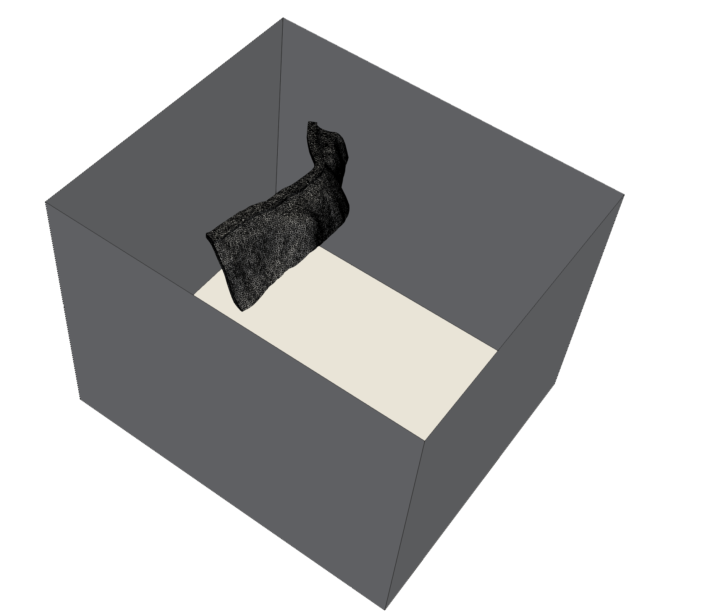

# Module 4: Insertion Box

Insertion of the subduction in the bounding-box.

<p align="center">
 
</p>


Run the following script in the current directory:

```
./04_insertion_box.sh
```

---

## File details
---

- [`insert_slab.py`](insert_slab.py): Manual construction of the surface's triangulation
- [`fill_volume.inp`](fill_volume.inp): Fill and remesh the box

## Notes

The manual triangulation of the surface is straightforward in this case.
If needed, an automatic triangulation tool could be used, e.g. [CDT](https://github.com/artem-ogre/CDT).
