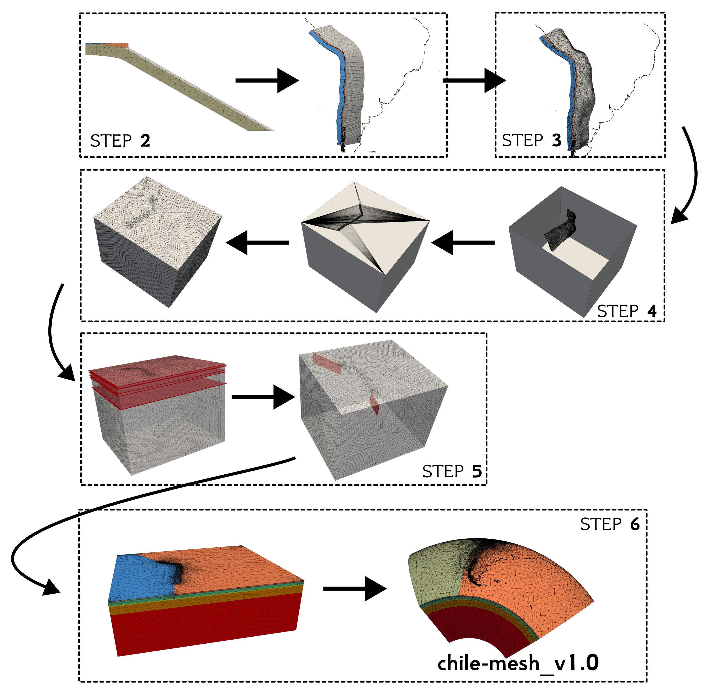

#  **A finite-element mesh of the Chilean subduction zone**

Hugo Boulze (1), Jean-Didier Garaud (2), Luce Fleitout (1), Emilie Klein (1), Vincent Chiaruttini (2) and Christophe Vigny (1)

(1) Laboratoire de Géologie, CNRS - Ecole normale supérieure - PSL University, Paris, France
(2) ONERA - The French Aerospace Lab, F-92322 Châtillon, France

Contacts: boulze@geologie.ens.fr, jean-didier.garaud@onera.fr

How to cite :
Please, when using chile-mesh_v1.0 or any content from this work cite *xxx*

#### **Abstract**

mettre abstract papier pour comprendre dans quel objectif est fait ce maillage

## **Mesh construction**

[**STEP 1**](01_surface_slab/README.md): Creation of the surface of the slab based on Slab2.0.

[**STEP 2**](02_slab_2D_to_3D/README.md): Creation of the subduction interface. First the 2D slice of the interface is drawn. Then, it is extended to 3D along the path of the subduction trench.

[**STEP 3**](03_deform_slab/README.md): The slab is deformed according to the surface of Slab2.0.

[**STEP 4**](04_insertion_box/README.md): The subduction mesh is inserted in the mesh box using Zcracks.

[**STEP 5**](05_plane_cuts/README.md): The planes at a given depth (e.g. -70km, -200km) are created by knifing the mesh.

[**STEP 6**](06_reassign_remesh/README.md): The elsets (e.g. LITHOSPHERE, ASTHENOSPHERE) are finally created. The mesh is refined.

 

##  **Prerequisites**

The script `check_prerequisites.sh` verifies some software prerequisites.

The pipeline works successfully with:
- [Zset](http://zset-software.com/), using a development version svn:23164.
- [GMT](https://docs.generic-mapping-tools.org/latest/index.html), version 6.3.0
- [MMG](http://www.mmgtools.org/), version 5.7.3
