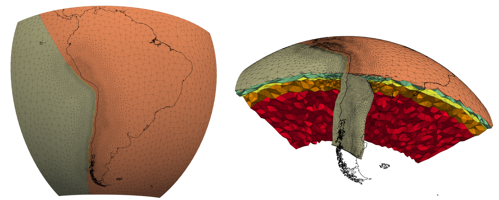
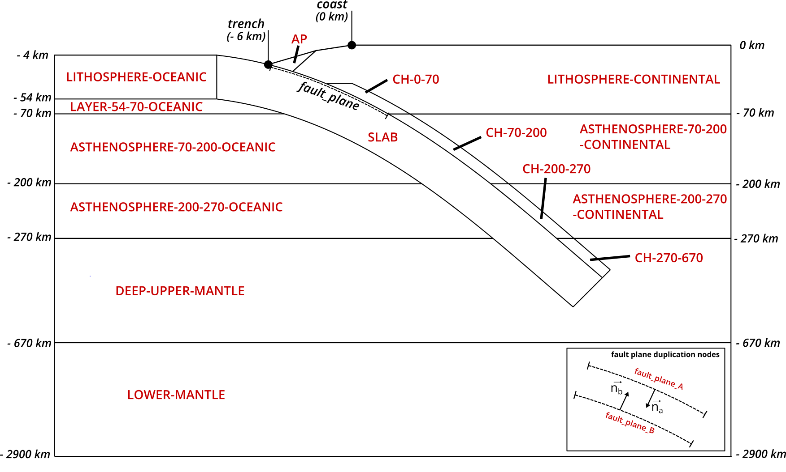

# A 3D finite-element mesh of the Chilean subduction zone, including flat-slabs, for viscoelastic deformation modeling

#### Hugo Boulze1, Jean-Didier Garaud2, Luce Fleitout1, Emilie Klein1, Vincent Chiaruttini2 and Christophe Vigny1

*1 Laboratoire de Géologie, CNRS - Ecole normale supérieure - PSL University, Paris, France*

*2 DMAS, ONERA, Université Paris-Saclay, 92320, Châtillon, France*

<u>**Contacts**</u> : [boulze@geologie.ens.fr](mailto:boulze@geologie.ens.fr), [jean-didier.garaud@onera.fr](mailto:jean-didier.garaud@onera.fr)

<u>**How to cite**</u> :
Please, when using *chile-mesh_v1.0* or any content from this work cite *xxx*

### Licenses

All files within this repository are distributed under the GNU GPL-v3 license, with the following exceptions:
- Mesh files <a property="dct:title" rel="cc:attributionURL" href="https://github.com/hugoboulze/chile-mesh">Chile Mesh 1.0 (.geof, .inp, .gmsh)</a> by <a rel="cc:attributionURL dct:creator" property="cc:attributionName" href="https://orcid.org/0000-0001-9935-3145">Hugo Boulze</a> are licensed under <a href="https://creativecommons.org/licenses/by-nc-sa/4.0/?ref=chooser-v1" target="_blank" rel="license noopener noreferrer" style="display:inline-block;">CC BY-NC-SA 4.0</a>
- If a specific file explicitly states an alternate licensing terms, those terms shall supersede the default GPL-v3 license for that particular file.

## Geophysical zones included in *chile-mesh_v1.0*

2D-sketch representing the geophysical zones included in chile-mesh_v1.0. CH: channel. AP: Accretionary prism. The fault-plane
extends from -6 km to -70 km depth. The node-split technique of the fault-plane (Melosh et Raefsky, 1981) gives two groups of nodes: fault plane A and fault plane B, respectively oriented towards the Earth center and towards the surface. Depth of zones is indicated as an italic number.

## Mesh construction

[**STEP 1**](01_surface_slab/README.md): Creation of a .csv file containing the coordinates (lon, lat, depth) of surface of the slab based on Slab2.0.

[**STEP 2**](02_slab_2D_to_3D/README.md): Creation of the subduction interface. First the 2D slice of the interface is drawn. Then, it is extended to 3D along the path of the subduction trench.

[**STEP 3**](03_deform_slab/README.md): The slab is deformed according to the surface of Slab2.0.

[**STEP 4**](04_insertion_box/README.md): The subduction mesh is inserted in the mesh box using Zcracks.

[**STEP 5**](05_plane_cuts/README.md): The planes at a given depth (e.g. -70km, -200km) are created by knifing the mesh.

[**STEP 6**](06_reassign_remesh/README.md): The elsets (e.g. LITHOSPHERE, ASTHENOSPHERE) are finally created. The mesh is refined.

 

##  Prerequisites

The script `check_prerequisites.sh` verifies some software prerequisites.

The pipeline works successfully with:
- [Zset](http://zset-software.com/), using a development version svn:23164.
- [GMT](https://docs.generic-mapping-tools.org/latest/index.html), version 6.3.0.
- [MMG](http://www.mmgtools.org/), version 5.7.3.
